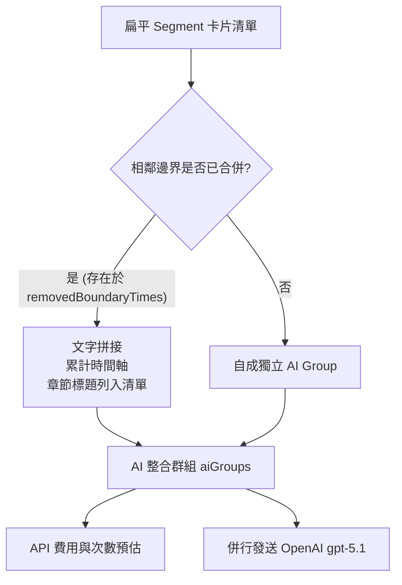

# GoldTubeHouse 核心業務邏輯說明文件 (Core Logic Specification)

本文件詳盡記錄了 GoldTubeHouse 系統中三大核心模組的業務邏輯、演算法數學公式、資料結構與前後端通訊協議：
1. **字幕分段區塊邏輯 (Subtitle Segmentation & Editing)**
2. **重點整理筆記邏輯 (Collapsible AI Notes Grouping)**
3. **專業術語對照表邏輯 (Professional Terms Partitioning)**

---

## 1. 字幕分段區塊邏輯 (Subtitle Segmentation)

字幕分段模組負責將影片的原始字幕（Subtitle Entries）整理並切割成結構化的時間區段。此模組實作於前端 [utils.ts](file:///Users/linchengyi/PycharmProjects/GoldTubeHouse/frontend/src/utils.ts) 的 `generateSegments` 與其附屬函數中。

### 1.1 關鍵控制參數與門檻值
* **自訂分段區間 (`interval`, 預設 20 分鐘 / 1200 秒)**：自動分段時的基準目標長度。
* **直接顯示門檻 (`noSegThreshold`, 預設 30 分鐘 / 1800 秒)**：若影片總時長低於此門檻，判定無須分段，整部影片視為單一區塊直接顯示。
* **超長章節細分門檻 (`subSegThreshold`, 預設 30 分鐘 / 1800 秒)**：當單一章節（Chapter）長度大於此門檻時，會以 `interval` 為單位進行子段落（Sub-segments）切分。

### 1.2 智慧句尾對齊演算法 (`findBestSplitIndex`)
為避免分段點生硬地切在半個句子中，系統使用搜尋視窗機制：
* **搜尋半徑**：在目標切分時間點的前後 $\pm$ 120 秒（共 240 秒）的搜尋視窗內。
* **語意標點匹配**：優先尋找以句尾標點符號（包括中文 `。`、`！`、`？` 以及英文 `.`, `!`, `?`）結尾的字幕條目，並以此條目結尾作為真正的切分點。
* **容錯機制**：若視窗內找不到任何句尾標點，則降級直接切在目標時間點。

### 1.3 尾部自動合併機制 (Trailing Segment Merging)
為了避免分段在最後產生極短的碎片區塊：
* **合併門檻**：設為 $\min(360, \text{interval} \times 0.5)$（在預設 20 分鐘區間下，為 6 分鐘 / 360 秒）。
* **邏輯**：如果切分後剩餘的影片尾部長度小於此門檻，系統會將該尾部直接合併併入當前段落中，使其一路延伸至結尾。

### 1.4 手動鍵盤 Enter 切分邏輯
使用者在主介面卡片文字中按下 **Enter 鍵** 時，系統執行兩大安全與精準對齊機制：
1. **安全邊界檢查**：為防止切出無意義的極短片段，手動切出的前半段時長必須大於 5 分鐘（300 秒），否則系統會彈出警告並自動合併還原。
2. **句內單字精準切分 (Subtitle Entry Splitting)**：若 Enter 位置落在一行字幕的中間（如：`Part A. So Part B`），系統會：
   * 計算字元比例：$\text{ratio} = \frac{\text{length(Part A)}}{\text{length(Part A)} + \text{length(Part B)}}$
   * 分配前半段時長：$\text{duration}_1 = \text{duration}_{\text{original}} \times \text{ratio}$
   * 分配後半段時長：$\text{duration}_2 = \text{duration}_{\text{original}} \times (1 - \text{ratio})$
   * 分配後半段起點：$\text{start}_2 = \text{start}_{\text{original}} + \text{duration}_1$
   * 將原始字幕條目拆分為二，重新拼入字幕清單，並以此 $\text{start}_2$ 時間點作為分段點。

---

## 2. 重點整理筆記邏輯 (Collapsible AI Notes Grouping)

重點整理模組將多個相鄰的字幕卡片以「非實體摺疊」的方式進行合併，從而大幅降低 API 的呼叫次數，並在發送時傳遞清晰的上下文資訊。



### 2.1 AI 整合分群與邊界控制
* **非實體合併狀態 (`removedBoundaryTimes`)**：儲存被合併的卡片起始時間。被合併的邊界在 UI 上不會使卡片消失，以維護卡片獨立編輯的能力，但在 AI 生成時會被打包。
* **金黃色整合連結線**：在卡片邊界處，若時間戳記存在於 `removedBoundaryTimes` 中，邊界按鈕變更為「⊖ 取消 AI 整合」，左右線條顯示為亮金色的實線 `.merged-ai .merge-line`。
* **雙向狀態切換**：
  - 手動點擊「⊕ 合併此章節 (AI 整合)」或「⊖ 取消 AI 整合」，會對 `removedBoundaryTimes` 執行 Toggle 操作（添加或移除）。
  - **範圍合併 (Batch Range Merge)**：在側邊欄選擇起始與結束區段，點擊「🔗 範圍合併」，會將該範圍內所有邊界時間戳記一次性加入 `removedBoundaryTimes`；點擊「🔓 範圍拆分」則一次性移除。

### 2.2 摺疊外層群組容器 (`renderingAIGroups`)
* **層級包裝**：
  * 在 UI 渲染時，系統透過 `renderingAIGroups` 將相鄰被合併的 Segments 包裹在同一個黃金色虛線容器 `.ai-merged-group-container` 中。
  * 提供摺疊標題 `🧠 AI 整合區間 (X 個章節)`，點擊可一次摺疊/展開容器內所有的卡片，摺疊狀態會自動同步儲存至 `localStorage`。

### 2.3 AI 提示詞上下文與後端處理
* **條列式目錄傳遞**：發送給 AI 的 `current_title` 會自動彙整該 AI Group 內涵蓋的所有章節，格式如下：
  ```markdown
  * [00:00] Intro: Meet Terminator Terry
  * [00:58] Employee Onboarding: Teaching Terry the Basics
  ```
  AI 將依據此清單，在重點整理中明確標記每個主題的時段，避免產生資訊丟失或主題混亂。
* **後端多執行緒併發處理 (Backend Concurrency)**：
  - 後端 API 端點定義為同步的 `def`（而非 `async def`）。
  - 當前端多個 AI 區塊併行發送 `/api/generate-block-note` 時，FastAPI 會指派給內部**執行緒池 (Thread Pool)** 以多執行緒並行呼叫 OpenAI，使生成時間縮短數倍。
* **清單扁平化處理 (`flatten_markdown_lists`)**：後端會使用正則表達式，自動將 OpenAI 回傳內容中的多層級（Nested）縮排列表扁平化為單一層級無序清單，維持筆記的簡潔性。

---

## 3. 專業術語對照表邏輯 (Professional Terms Partitioning)

專業術語對照表模組根據影片的長度與特定的時長限制，自動對字幕進行分批發送，獨立於重點整理筆記的合併狀態。實作於 [utils.ts](file:///Users/linchengyi/PycharmProjects/GoldTubeHouse/frontend/src/utils.ts) 的 `groupSegmentsForTerms` 中。

### 3.1 時長導向分批分群演算法
本演算法旨在滿足以下邊界限制條件（$D$ 為影片總時長，單位為秒）：

$$\text{若 } D < 3600\text{ 秒} \implies \text{全影片合併為 1 批發送}$$

$$\text{若 } D \ge 3600\text{ 秒} \implies \text{每批次時長 } D_{\text{batch}} \ge 3600\text{ 秒，且最後一批 } D_{\text{last}} \ge 1800\text{ 秒}$$

#### 演算法執行步驟 Trace
1. 初始化 `startIdx = 0`。
2. 遍歷卡片結束點 $t_i$：
   * 計算該批次時長：$\text{duration} = t_i - startVal$。
   * 計算剩餘影片長度：$\text{remaining} = \text{totalDuration} - t_i$。
   * **切分條件**：若 $\text{duration} \ge 3600$ 且（$\text{remaining} \ge 1800$ 或 $\text{remaining} = 0$）：
     * 在 $t_i$ 處切分，此範圍所有 Segments 打包為一組 `TermsBatch`。
     * 設定新起點 `startIdx = i + 1`，並重置當前搜尋。
3. **尾部重分配與自動合併**：
   * 若遍歷到影片尾端，仍找不到符合上述切分條件的點，說明若在任何地方切分，最後一批都會低於 30 分鐘。
   * 此時演算法會進入 `else` 降級分支，**停止切分**，直接將剩餘的所有卡片合併發送（生成最後一組 `TermsBatch`）。

### 3.2 編輯內容同步與 AI 提示規格
* **手動編輯同步**：在分批提取文字前，系統會生成一個 `activeSegmentsWithEdits` 清單。如果使用者在畫面中修改過某段落的錯別字，該 Segments 的 subtitles 會自動被更新為修改後的內容，確保發送給 AI 的是最正確的字幕。
* **AI 提示詞規格**：
  * 對照表提取時，呼叫後端 `/api/generate-block-terms`。
  * 提示詞指令規定 AI **最多提取 50 個重要專業術語**，格式規定為繁體中文，且只輸出術語清單：
    `* 中文專業術語（英文）：解釋`

---

## 4. 模組行為與計費比對表

下表對比了系統在不同分段與 AI 發送功能下的行為指標：

| 功能項目 | 字幕分段區塊 | 重點整理筆記 | 專業術語對照表 |
| :--- | :--- | :--- | :--- |
| **分割單位** | 字幕條目（Subtitle Entry） | 卡片（Segment / Sub-segment） | 卡片（Segment / Sub-segment） |
| **合併依據** | 手動 Enter 切分後的自動合併門檻 | `removedBoundaryTimes` 的合併狀態 | 智慧時長分群演算法 (`groupSegmentsForTerms`) |
| **單批時長限制**| 無限制 | 無限制（由用戶手動/範圍控制） | 中間批次 $\ge 1.0$h，尾部批次 $\ge 30$m |
| **UI 卡片狀態** | 平面卡片或章節資料夾 | 黃金色整合連結線、外層可摺疊容器 | 在獨立分頁中以摺疊面板顯示結果 |
| **估算與呼叫數**| 不呼叫 AI | 等於 AI 整合群組數 (`aiGroups.length`) | 等於時長分群數 (`aiTermsGroups.length`) |
| **發送上下文** | 不發送 | 當前群組目錄 + 全影片完整大綱 | 當前群組目錄 + 全影片完整大綱 |
